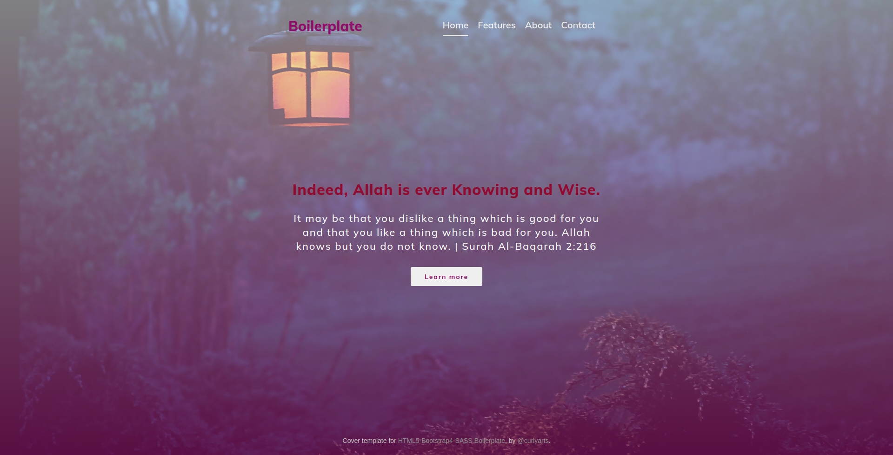

# [HTML5-Bootstrap4-SASS-Boilerplate](https://github.com/curlyarts/HTML5-Bootstrap4-SASS-Boilerplate)

[](https://curlyarts.github.io/HTML5-Bootstrap4-SASS-Boilerplate/)

[](https://github.com/curlyarts/HTML5-Bootstrap4-SASS-Boilerplate/blob/master/LICENSE.txt)
[](https://github.com/curlyarts/HTML5-Bootstrap4-SASS-Boilerplate/)

The HTML5-Bootstrap4-SASS Boilerplate to quickstart a HTML5-Bootstrap4-SASS project!!

HTML5-Bootstrap4-SASS Boilerplate is a professional front-end template for building fast, robust, and adaptable Bootstrap4 web apps or sites.


#### Table of Contents
* [Quick Start](#quick-start)
* [Versions](#versions)
* [Key Features](#key-features)
* [Files Included](#files-included)
* [CSS and JavaScript Libraries](#css-and-javascript-libraries)
* [File Structure](#file-structure)
* [Browser Support](#browser-support)
* [Resources](#resources)
* [License](#license)


#### Quick Start
- Clone the repo: `git clone https://github.com/curlyarts/HTML5-Bootstrap4-SASS-Boilerplate.git --branch v1.0.0 --single-branch --depth 1`
- Go inside the folder: `cd HTML5-Bootstrap4-SASS-Boilerplate`
- Install necessary libraries: `npm install`
- Build CSS: `npm run build:css`
- Run Project: `npm run start`
- - This command will run your project in the 9000 PORT of your local server.
- - It will automatically open a new tab in your default browser. Otherwise, go to your browser and enter `127.0.0.1:9000`
- Development: `npm run dev`
- - If you are developing a template and parallelly want to see the progress, this command will always watch your SASS files and continuously compile, build CSS and update the DOM in the browser.


#### Versions
[1.0.0](https://github.com/curlyarts/HTML5-Bootstrap4-SASS-Boilerplate/releases/v1.0.0)


#### Key Features:
1. Built with latest Bootstrap 4
1. Built with SASS
1. Google fonts support
1. Font Awesome support
1. Free updates


#### Files Included:
1. index.html file (Demo Boilerplate HTML Template)
1. Supporting SASS, JS files
1. package.json


#### CSS and JavaScript Libraries:
1. Bootstrap 4
1. Font Awesome Icon 5
1. jQuery


#### File Structure
```
├─ .gitignore
├─ assets
│  ├─ css
│  │  └─ styles.css
|  ├─ doc
|  |  ├─ screenshot.jpg
│  │  └─ ...
│  ├─ js
│  │  └─ scripts.js
│  └─ sass
│     ├─ abstracts
│     │  ├─ _fonts.scss
│     │  ├─ _mixins.scss
│     │  └─ _variables.scss
│     ├─ base
│     │  ├─ _animations.scss
│     │  ├─ _base.scss
│     │  ├─ _typography.scss
│     │  └─ _utilities.scss
│     ├─ components
│     │  └─ _card.scss
│     ├─ layouts
│     │  ├─ _footer.scss
│     │  └─ _header.scss
│     ├─ main.scss
│     └─ pages
│        └─ _home.scss
├─ favicon.ico
├─ index.html
├─ LICENSE
├─ package.json
└─ README.md
```


#### Browser Support
    

#### Resources
- Demo: [https://curlyarts.github.io/HTML5-Bootstrap4-SASS-Boilerplate/](https://curlyarts.github.io/HTML5-Bootstrap4-SASS-Boilerplate/)
- Download Page: [Clone or Download](https://github.com/curlyarts/HTML5-Bootstrap4-SASS-Boilerplate)
- Documentation: [README.md](https://github.com/curlyarts/HTML5-Bootstrap4-SASS-Boilerplate/blob/master/README.md)
- Issues: [Github Issues Page](https://github.com/curlyarts/HTML5-Bootstrap4-SASS-Boilerplate/issues)


#### License

Copyright © 2020 [CurlyArts](https://curlyarts.com/).

The code is available under the MIT license.


##### Social Media

[Facebook](https://www.facebook.com/CurlyArts.Official/)

[Twitter]()

[Dribbble]()